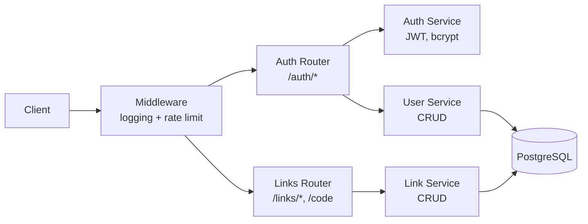
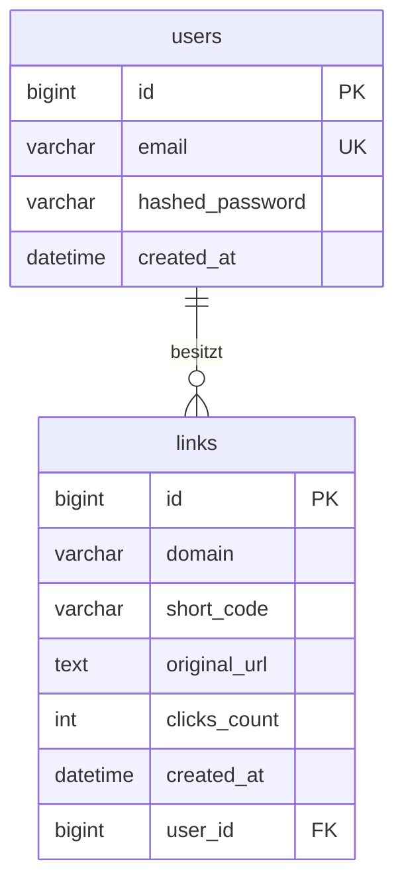
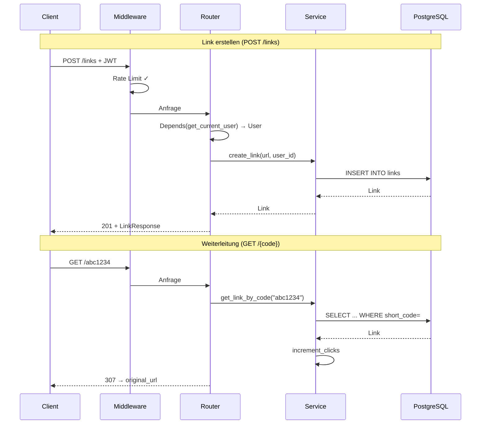
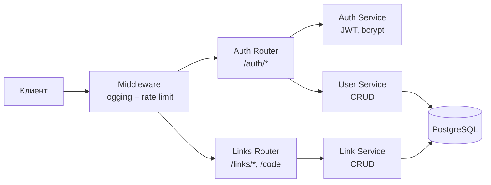
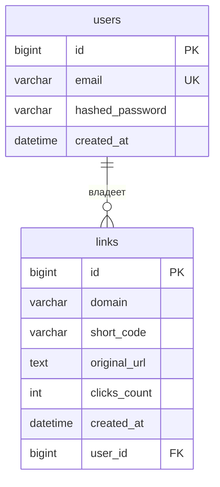

# Link Shortener

> Zweisprachige README: **Deutsch zuerst**, die russische Originalversion folgt
> weiter unten (nach dem Trenner `---`).

Kurz-URL-Dienst. Pet-Projekt zum Erlernen von FastAPI, React, Docker und Kubernetes.

**Live-Service:** https://s.faiuk.me (Oberfläche auf Deutsch)

## Stack

Backend:

- Python 3.13, [uv](https://docs.astral.sh/uv/)
- FastAPI + Uvicorn (async)
- PostgreSQL + SQLAlchemy 2.x (async) + Alembic
- JWT-Authentifizierung (bcrypt + PyJWT)
- Ruff (Linter/Formatter)

Frontend (`frontend/`):

- React 19 + Vite + TypeScript
- Tailwind CSS v4, TanStack Query, react-router-dom v7, react-i18next (Deutsch)
- Vitest + React Testing Library — Unit-Tests
- oxlint — Linter

Infrastruktur:

- Docker + Docker Compose (Backend, Frontend, Postgres — 3 Images)
- Caddy — Reverse Proxy, automatisches TLS, Routing über eine Domain
- GitHub Actions — CI (Lint+Tests bei PR) und CD (Image-Build, Auto-Deploy bei Push nach `main`)
- Hetzner Cloud — Produktionsserver

## Architektur

Schichtenarchitektur im Backend: Router (HTTP) → Service (Geschäftslogik) → Model (DB).



In Produktion steht vor dem Backend Caddy — eine Domain, Routing nach Pfad:
`/api/*` → Backend (FastAPI), SPA-Seiten (`/`, `/login`, `/dashboard`, ...) →
Frontend (nginx mit statischen Dateien), alles andere (Kurzcodes, `/docs`) → Backend.
Details — `docker/Caddyfile` und [docs/deploy.md](docs/deploy.md).

## Datenbankschema



## Request-Flow



## Start

### Variante A — gesamter Stack in Docker (am einfachsten)

```bash
cp .env.example .env              # Werte ausfüllen (mindestens SECRET_KEY)
docker compose up --build         # startet app + frontend + Postgres
# → http://localhost:8000/docs    (Backend)
# → http://localhost:3000         (Frontend, Produktions-Build über nginx)
```

Der Container `app` wendet Migrationen (`alembic upgrade head`) beim Start selbst an.
Die DB-Daten liegen im named volume `pgdata` und überleben `docker compose down`.

### Variante B — hybrider Dev-Modus (Hot-Reload)

Die DB läuft in Docker, Backend und Frontend lokal (Hot-Reload, Debugging in der IDE):

```bash
# Backend
uv sync
cp .env.example .env              # DATABASE_URL zeigt bereits auf localhost:5434
docker compose up -d db           # nur Postgres (Port 5434 nach außen)
uv run alembic upgrade head       # Migrationen vom Host aus
uv run uvicorn app.main:app --reload
# → http://localhost:8000/docs

# Frontend (in einem separaten Terminal)
cd frontend
npm install
npm run dev
# → http://localhost:5173 (proxyt /api auf localhost:8000)
```

> SQL-Logs in der Konsole werden über die Variable `DB_ECHO=true` in `.env` aktiviert (standardmäßig deaktiviert).

## API

| Methode | Pfad | Auth | Beschreibung |
|-------|------|:-----------:|----------|
| `POST` | `/auth/register` | — | Registrierung |
| `POST` | `/auth/login` | — | Login → JWT-Token |
| `GET` | `/auth/me` | 🔒 | Daten des aktuellen Nutzers |
| `POST` | `/links` | 🔒 | Kurzlink erstellen |
| `GET` | `/links?limit=&offset=` | 🔒 | Seite der eigenen Links (Envelope `{items, total, limit, offset}`) |
| `GET` | `/links/{code}` | — | Informationen zum Link |
| `GET` | `/{code}` | — | Weiterleitung → Ziel-URL |

Vollständige interaktive Dokumentation — unter `/docs` (Swagger UI).

## Frontend

SPA auf Deutsch: Landingpage, Registrierung/Login, `/dashboard` (Links erstellen,
Liste mit Pagination, in die Zwischenablage kopieren), `/about` ("Über das
Projekt" — Visitenkarte für Recruiter). JWT wird im `localStorage` gespeichert,
Server-Zustand über TanStack Query. Mehr zu den Entscheidungen — [DECISIONS.md](DECISIONS.md).

## Tests

Backend:

```bash
docker compose -f docker-compose.test.yml up -d   # Test-DB (Port 5433, Daten im RAM)
uv run pytest -v
uv run pytest --cov=app --cov-report=term-missing
uv run pytest tests/unit/ -v
uv run pytest tests/integration/ -v
```

82 Tests, 92 % Testabdeckung. Isolation über SAVEPOINT + Rollback (echtes Postgres, keine DB-Mocks).

Frontend:

```bash
cd frontend
npm run test    # Vitest + React Testing Library
npm run lint     # oxlint
```

## Docker

- `Dockerfile` — Multi-Stage (Builder → Runtime), Non-Root-User, Caching der Dependency-Schicht.
  Finales Image ~68 MB (komprimiert).
- `frontend/Dockerfile` — Multi-Stage (Node → nginx): Vite-Build, statische Dateien werden von nginx ausgeliefert.
- `docker-compose.yml` — app + frontend + Postgres, Verbindung über DNS-Namen, Healthcheck, persistentes Volume.
- `docker-compose.prod.yml` — Produktions-Override: Images aus GHCR statt lokalem Build, Caddy als Reverse Proxy mit Auto-TLS.
- `docker/entrypoint.sh` — Migrationen vor dem Start des Servers.
- `docker-compose.test.yml` — separate Test-Datenbank (Daten im RAM, Port 5433).

## CI/CD und Deployment

- **CI** (`.github/workflows/ci.yml`, bei jedem PR): ruff (Lint+Format) und pytest für das Backend,
  oxlint + Vitest + `tsc`/`vite build` für das Frontend — Gate vor dem Merge.
- **CD** (`.github/workflows/deploy.yml`, bei Push nach `main`): Tests → Build beider Docker-Images
  → Push nach GHCR → SSH-Deployment nach Hetzner (Pull der Images, `caddy reload`).

Produktionsserver: Hetzner Cloud CX22, Caddy + automatisches TLS, tägliches DB-Backup.
Ausführliche Server-Anleitung — [docs/deploy.md](docs/deploy.md).

## Status

Backend, Authentifizierung, Tests, Docker, Deployment, CI/CD und Frontend — fertig und live im Einsatz.
Die Roadmap (Monitoring, Redis, Kubernetes, weitere Features) — in [CLAUDE.md](CLAUDE.md),
zentrale Entscheidungen und deren Gründe — in [DECISIONS.md](DECISIONS.md).

---

> Русская версия (оригинал, для контекста разработки).

# Link Shortener

Сервис сокращения ссылок. Пет-проект для изучения FastAPI, React, Docker и Kubernetes.

**Живой сервис:** https://s.faiuk.me (интерфейс на немецком)

## Стек

Бэкенд:

- Python 3.13, [uv](https://docs.astral.sh/uv/)
- FastAPI + Uvicorn (async)
- PostgreSQL + SQLAlchemy 2.x (async) + Alembic
- JWT-авторизация (bcrypt + PyJWT)
- Ruff (линтер/форматтер)

Фронтенд (`frontend/`):

- React 19 + Vite + TypeScript
- Tailwind CSS v4, TanStack Query, react-router-dom v7, react-i18next (немецкий)
- Vitest + React Testing Library — юнит-тесты
- oxlint — линтер

Инфраструктура:

- Docker + Docker Compose (backend, frontend, Postgres — 3 образа)
- Caddy — reverse proxy, автоматический TLS, роутинг одним доменом
- GitHub Actions — CI (линт+тесты на PR) и CD (сборка образов, автодеплой на push в `main`)
- Hetzner Cloud — прод-сервер

## Архитектура

Слоистая структура бэкенда: роутер (HTTP) → сервис (бизнес-логика) → модель (БД).



На проде перед бэкендом стоит Caddy — один домен, роутинг по пути:
`/api/*` → бэкенд (FastAPI), страницы SPA (`/`, `/login`, `/dashboard`, ...) →
фронтенд (nginx со статикой), всё остальное (короткие коды, `/docs`) → бэкенд.
Подробности — `docker/Caddyfile` и [docs/deploy.md](docs/deploy.md).

## Схема БД



## Поток запроса


## Запуск

### Вариант A — весь стек в Docker (проще всего)

```bash
cp .env.example .env              # заполнить значения (как минимум SECRET_KEY)
docker compose up --build         # поднимет app + frontend + Postgres
# → http://localhost:8000/docs    (backend)
# → http://localhost:3000         (frontend, прод-сборка через nginx)
```

Контейнер `app` сам применяет миграции (`alembic upgrade head`) при старте.
Данные БД лежат в named volume `pgdata` и переживают `docker compose down`.

### Вариант B — гибридный dev-режим (hot-reload)

БД поднимаем в Docker, бэкенд и фронтенд — локально (hot-reload, отладка в IDE):

```bash
# Бэкенд
uv sync
cp .env.example .env              # DATABASE_URL уже указывает на localhost:5434
docker compose up -d db           # только Postgres (порт 5434 наружу)
uv run alembic upgrade head       # миграции с хоста
uv run uvicorn app.main:app --reload
# → http://localhost:8000/docs

# Фронтенд (в отдельном терминале)
cd frontend
npm install
npm run dev
# → http://localhost:5173 (проксирует /api на localhost:8000)
```

> SQL-логи в консоль включаются переменной `DB_ECHO=true` в `.env` (по умолчанию выключены).

## API

| Метод | Путь | Авторизация | Описание |
|-------|------|:-----------:|----------|
| `POST` | `/auth/register` | — | Регистрация |
| `POST` | `/auth/login` | — | Логин → JWT-токен |
| `GET` | `/auth/me` | 🔒 | Данные текущего пользователя |
| `POST` | `/links` | 🔒 | Создать короткую ссылку |
| `GET` | `/links?limit=&offset=` | 🔒 | Страница списка своих ссылок (конверт `{items, total, limit, offset}`) |
| `GET` | `/links/{code}` | — | Информация о ссылке |
| `GET` | `/{code}` | — | Редирект → оригинальный URL |

Полная интерактивная документация — на `/docs` (Swagger UI).

## Фронтенд

SPA на немецком языке: лендинг, регистрация/логин, `/dashboard` (создание
ссылок, список с пагинацией, копирование в буфер), `/about` («Über das
Projekt» — витрина для рекрутёра). JWT хранится в `localStorage`, серверное
состояние — через TanStack Query. Подробнее о решениях — [DECISIONS.md](DECISIONS.md).

## Тесты

Бэкенд:

```bash
docker compose -f docker-compose.test.yml up -d   # тестовая БД (порт 5433, данные в RAM)
uv run pytest -v
uv run pytest --cov=app --cov-report=term-missing
uv run pytest tests/unit/ -v
uv run pytest tests/integration/ -v
```

82 теста, покрытие 92%. Изоляция через SAVEPOINT + rollback (реальный Postgres, без моков БД).

Фронтенд:

```bash
cd frontend
npm run test    # Vitest + React Testing Library
npm run lint     # oxlint
```

## Docker

- `Dockerfile` — multi-stage (builder → runtime), non-root пользователь, кэширование
  слоя зависимостей. Финальный образ ~68 МБ (сжатый).
- `frontend/Dockerfile` — multi-stage (node → nginx): сборка Vite, статика раздаётся nginx.
- `docker-compose.yml` — app + frontend + Postgres, связь по DNS-именам, healthcheck, персистентный volume.
- `docker-compose.prod.yml` — прод-оверрайд: образы из GHCR вместо локальной сборки, Caddy как reverse proxy с авто-TLS.
- `docker/entrypoint.sh` — миграции перед запуском сервера.
- `docker-compose.test.yml` — отдельная тестовая БД (данные в RAM, порт 5433).

## CI/CD и деплой

- **CI** (`.github/workflows/ci.yml`, на каждый PR): ruff (линт+формат) и pytest для бэкенда,
  oxlint + Vitest + `tsc`/`vite build` для фронтенда — гейт перед merge.
- **CD** (`.github/workflows/deploy.yml`, на push в `main`): тесты → сборка обоих Docker-образов
  → пуш в GHCR → SSH-деплой на Hetzner (pull образов, `caddy reload`).

Прод-сервер: Hetzner Cloud CX22, Caddy + автоматический TLS, ежедневный бэкап БД.
Подробная шпаргалка по серверу — [docs/deploy.md](docs/deploy.md).

## Статус

Бэкенд, авторизация, тесты, Docker, деплой, CI/CD и фронтенд — готовы и работают на проде.
Дорожная карта (мониторинг, Redis, Kubernetes, дальнейшие фичи) — в [CLAUDE.md](CLAUDE.md),
ключевые решения и их причины — в [DECISIONS.md](DECISIONS.md).
