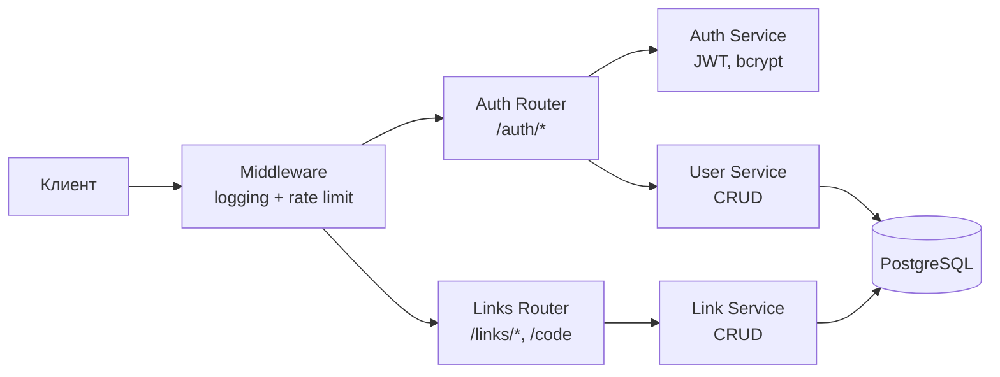
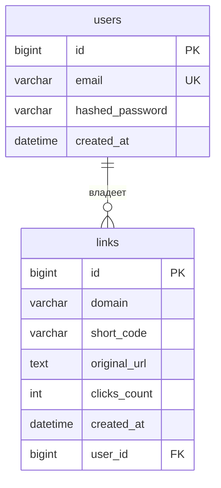

# Link Shortener

Сервис сокращения ссылок. Пет-проект для изучения FastAPI, Docker и Kubernetes.

## Стек

- Python 3.13, [uv](https://docs.astral.sh/uv/)
- FastAPI + Uvicorn (async)
- PostgreSQL + SQLAlchemy 2.x (async) + Alembic
- JWT-авторизация (bcrypt + PyJWT)
- Ruff (линтер/форматтер)

## Архитектура

Слоистая структура: роутер (HTTP) → сервис (бизнес-логика) → модель (БД).



## Схема БД



## Поток запроса


## Запуск (локально)

```bash
# 1. Зависимости
uv sync

# 2. Конфиг
cp .env.example .env    # заполнить значения

# 3. Postgres
docker run -d --name link-shortener-db \
  -e POSTGRES_USER=app -e POSTGRES_PASSWORD=app -e POSTGRES_DB=link_shortener \
  -p 5434:5432 postgres:17

# 4. Миграции
uv run alembic upgrade head

# 5. Сервер
uv run uvicorn app.main:app --reload
# → http://localhost:8000/docs
```

## API

| Метод | Путь | Авторизация | Описание |
|-------|------|:-----------:|----------|
| `POST` | `/auth/register` | — | Регистрация |
| `POST` | `/auth/login` | — | Логин → JWT-токен |
| `GET` | `/auth/me` | 🔒 | Данные текущего пользователя |
| `POST` | `/links` | 🔒 | Создать короткую ссылку |
| `GET` | `/links` | 🔒 | Список своих ссылок |
| `GET` | `/links/{code}` | — | Информация о ссылке |
| `GET` | `/{code}` | — | Редирект → оригинальный URL |

## Тесты

```bash
# Поднять тестовую БД (отдельный контейнер, порт 5433, данные в RAM)
docker compose -f docker-compose.test.yml up -d

# Запуск тестов
uv run pytest -v

# С покрытием
uv run pytest --cov=app --cov-report=term-missing

# Только unit / только integration
uv run pytest tests/unit/ -v
uv run pytest tests/integration/ -v
```

75 тестов, покрытие 92%. Изоляция через SAVEPOINT + rollback (реальный Postgres, без моков БД).

## Статус

🚧 В разработке. Дорожная карта — в [CLAUDE.md](CLAUDE.md), ключевые решения — в [DECISIONS.md](DECISIONS.md).
